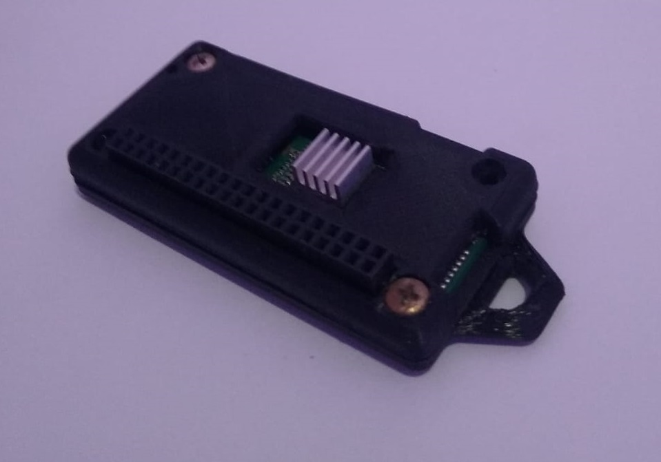
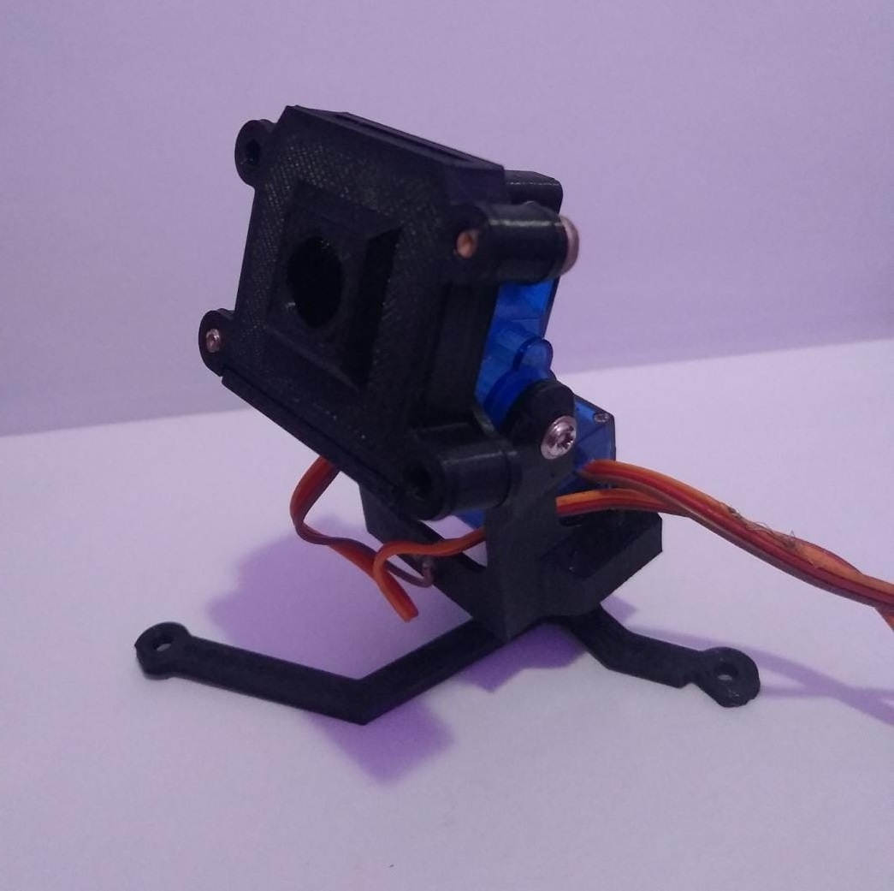
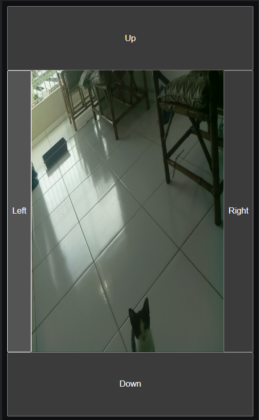

# Streaming de vídeo utilizando Raspberry Pi Zero

## Impressões 3d
Case - https://www.thingiverse.com/thing:1325361
<br>
Camera - https://www.thingiverse.com/thing:504196

<br>

## Streaming do vídeo
https://github.com/jacksonliam/mjpg-streamer

<br>




<br><br>

## Interface Mobile


<br>

## No Raspberry Pi
1 - Instalar todas as dependências
```bash
python -m venv venv
source venv/bin/activate
pip install -r requirements.txt
```

2 - Executar
```bash
source venv/bin/activate
flask --debug run --host=0.0.0.0
```


## Acesso
O Flask utiliza por padrão a porta 5000
Acesse a aplicação no navegador com o ip da sua Raspberry Pi + :5000
Exemplo: http://192.168.0.101:5000/
